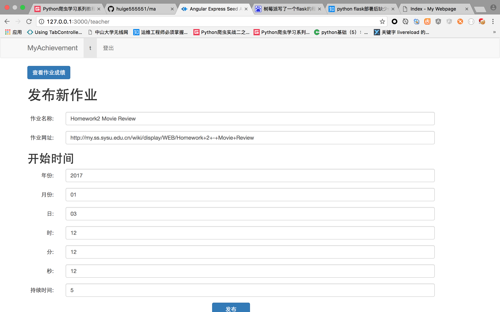

#myAchievement
##学生用户的功能与界面(没有实现分组)
1. 提交作业（给出github网址即可） (完成)
2. 查看TA的评论 (完成)
3. 查看作业 (完成)
4. 查看分数，排名 (完成)
5. 附加功能（过去所有作业的排名，分数) (没完成)

##TA用户的功能：
1. 给出分数  (完成)
2. 查看作业  (完成)

##教师用户功能：
1. 布置作业； (完成)
2. 查看评审作业；(完成)

##系统截图
- ta批改作业

- 登录

- 学生提交查看作业

- 老师发布作业

- 老师审阅作业

##启动：
npm install
npm start